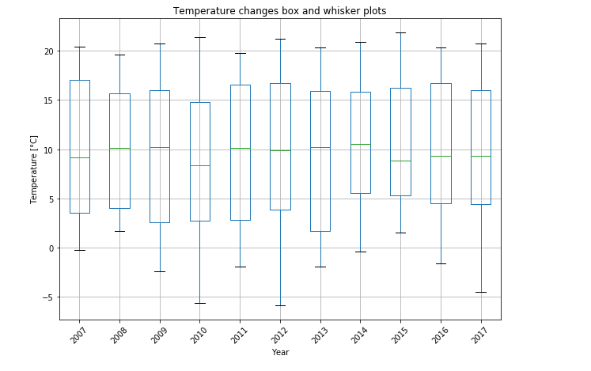
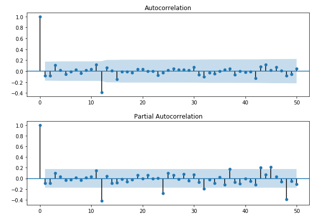
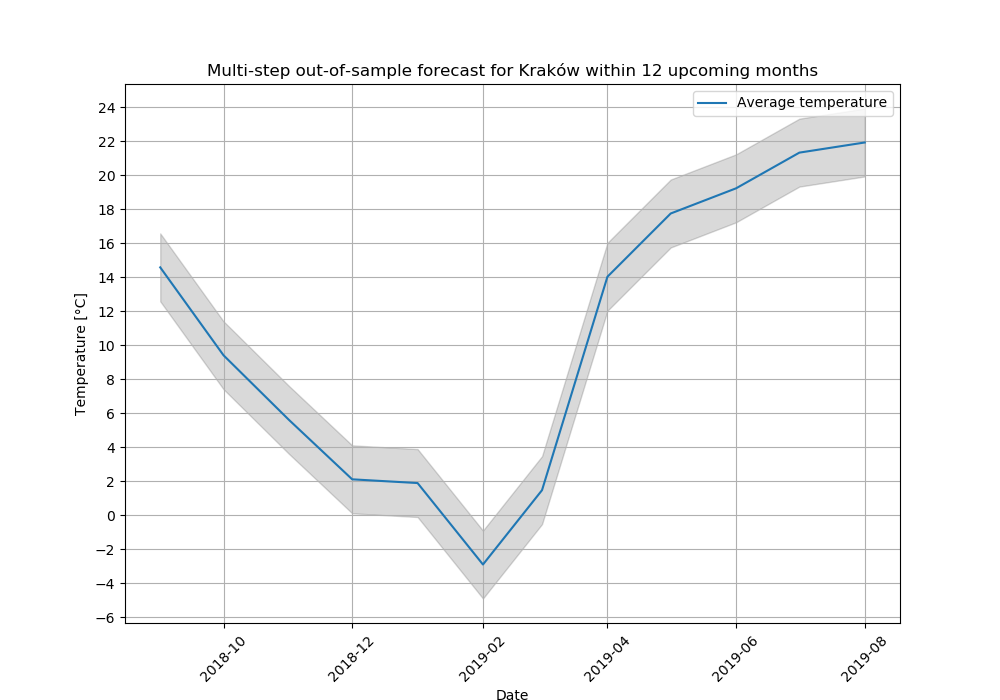

# Weather forecasting for Kraków
> The purpose of this project is to forecast average monthly temperature for Kraków, basing on provided observational dataset.
Undoubtedly, machine learning is an ideal way to evaluate time series included this one. 

## General info
The problem is to predict the average value of monthly temperature for Kraków. The dataset provides the monthly temperature from January 2007 to August 2018.

It is credited to Institute of Meteorology and Water Management, Poland. 

The dataset has been downloaded as a CSV file with the filename "Krakow_2007_2018.csv".

## Screenshots
<p align="center">



</p>

## Technologies
* Jupyter Notebook - version 5.6.0
>Jupyter Notebook documents are documents which contain both computer code and rich text elements. Notebook documents are both human-readable documents containing the analysis description and the results (figures, tables, etc..) as well as executable documents which can be run to perform data analysis.<br>(*based on: www.jupyter-notebook-beginner-guide.readthedocs.io*)
* Python - version 3.7

## Setup
In order to get insight into project results open **ARIMA.ipynb** file in one's browser. However if one wants to execute the whole code step by step, the Jupyter Notebooks is required to be installed on one's computer.

There are some advices, which can be helful to setup your local environement.The easiest way for a beginner to get started with Jupyter Notebooks is by installing Anaconda.

1. To get Anaconda, simply download the latest version of Anaconda for Python 3 using [this website](https://www.anaconda.com/) .
Install Anaconda by following the instructions on the download page and/or in the executable.
2. Open Git (if you do not have already installed it, click [here](https://git-scm.com/)) and clone the repo which contains ipynb notebook:
```
    $ git clone https://github.com/AleksandraPestka/Weather_forecasting/blob/master/ARIMA.ipynb
```
2. Go to the path where ipynb is cloned

3. Open Jupyter notebook to see the file.
```
    jupyter notebook ARIMA.ipynb
```


## Code Example
```
def evaluate_models(dataset, p_values, d_values, q_values):
    dataset_values=dataset.values
    dataset_values = dataset.astype('float32')
    best_score, best_cfg = float("inf"), None
    for p in p_values:
        for d in d_values:
            for q in q_values:
                order = (p,d,q)
                try:
                    mse = evaluate_arima.evaluate_arima_model(dataset_values, order)
                    if mse < best_score:
                        best_score, best_cfg = mse, order
                    print('ARIMA%s RMSE={:0.3f}'.format(order,mse))
                except:
                    continue
    print('Best ARIMA= {} RMSE= {:0.3f} '.format(best_cfg, best_score))
```

## Features
List of features ready:
* plotting a time series
* plotting seasonal line plots
* plotting density plot
* plotting box and whisker plots
* evaluating the best ARIMA model to the dataset
* reviewing residual errors
* making predictions for the new data 


## Inspiration
Project inspired by machine learning tutorials shared on the website: [Machine Learning Mastery](https://machinelearningmastery.com/start-here/)

## Authors 
Created by Piotr Pigoń  and Aleksandra Pestka. 
